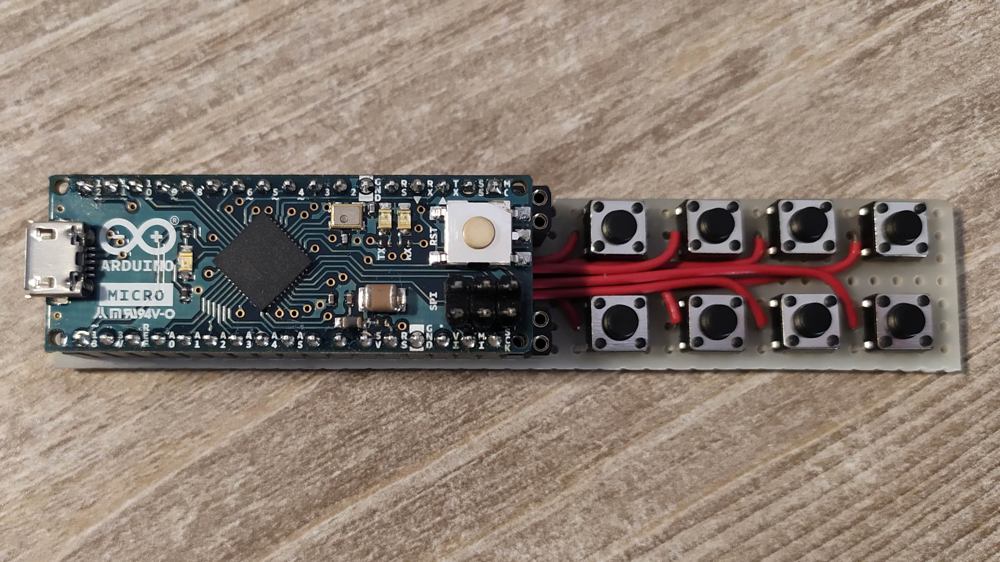

# micro-keyboard
micro-keyboard is an 8-key HID keyboard emulation.

Out of the eight buttons, the top-left one switches between different
pages:

- Page 1 emulates keys ESC, BACKSPACE, ENTER, LEFT_ARROW, DOWN_ARROW,
  UP_ARROW, RIGHT_ARROW (in order from left to right, top to bottom)
- Page 2 emulates keys F1 to F7
- Page 3 emulates keys F8 to F14

The number of pages and emulated keys can be easily customized.

The Arduino Micro built-in LED blinks when switching between pages.
It blinks a number of times equal to the page number.

To understand why I built this pretty weird project, see the paragraph
[Some backstory](#some-backstory).
For more details on the technical side, see the paragraph
[Implementation notes](#implementation-notes).

## Some backstory
I had an issue with my laptop. For some reason, it doesn't recognize
the built-in keyboard before booting the OS (it's probably a driver
issue but that's not my area of expertise).
It does however recognize external keyboards I have at home.

It's never been much of an issue. I rarely have to enter the BIOS when
I'm not at home.
However, a couple of weeks ago I had to install PSPICE on my laptop for
the ElectroMagnetic Compatibility course I'm taking at the university.
Unfortunately, that is a Windows-only software (but my main OS is Ubuntu).
I went for a dual boot cause it's a ten years old laptop and running
Windows on a VM was a bit too heavy.

Back to the issue.
When I'm at home, I code with an external monitor and keyboard.
So, I didn't discover the issue till it was too late: without an
external keyboard, I can't choose which OS to boot in.
GRUB just boots in the first OS on the list.

The two "immediate" solutions are:

- Boot in whichever the first OS on the list is. Change the boot order.
  Reboot the system. While it might work, it would take a good 20 minutes
  or so on my laptop.
- Carry an external keyboard to the university. An overkill just to
  choose which OS to boot in.

So, I decided to build a tiny custom "keyboard" I could easily
carry around.

## Implementation notes
While there are much better ways to implement a keyboard emulator, here
are the reasons why I chose to code it this way.

First of all, I had to use a [third-party HID library](https://github.com/NicoHood/HID)
cause the built-in `Keyboard.h` "library" was also not recognized at boot.

This was a last-minute solution.
Thus, my main goal was to get it done quickly.
I already had around the `Button.hpp` class (I wrote it back in high
school), so I took advantage of it. In fact:

- It's scalable: introducing new buttons is easy (in case I'll ever
  need more of them). With interrupts, it's a bit less immediate, plus
  not all pins feature interrupt capabilities.
- Abstraction: the library hides all the nitty-gritty details of how
  buttons are debounced, which (hopefully) increases the readability.
- **NO** Need For Speed: the particular case study doesn't require the
  keyboard to have the fastest possible time response (it's not meant for
  gaming!). Interrupts don't provide much benefit in this case.

Also, the LED lighting is a bit controversial: while the rest of the code
is non-blocking, I used the (blocking) `delay()` function to pulse the
LED. Reasons are:

- Those delays are anyway pretty fast.
- Eventually missing a key press is not an issue for this type of
  application.
- Implementing a non-blocking solution is more time-consuming and not
  worth for such a simple task.
